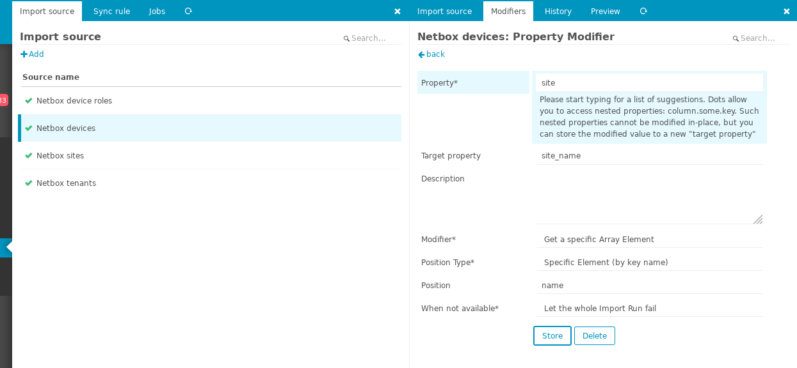
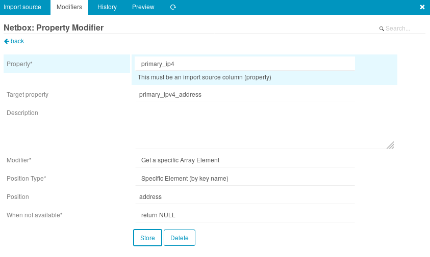
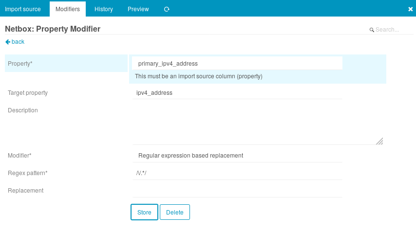

# Icingaweb2 Netbox

Icingaweb2 module to which, for now, just import objects from
[Netbox](https://github.com/netbox-community/netbox) into Icinga
Director.

Note: Tags from 2.10.3 onwards match the major netbox version, the 4th version number is for this module only.

## Install

Releases are managed on GitHub. [Latest](https://github.com/sol1/icingaweb2-module-netbox/releases/latest)

Installing a new release involves removing any old release from the icingaweb2 module path, then copying in the new files.
For example on Debian systems the path is `/usr/share/icingaweb2/modules`.

To install a new release, first uninstall any existing release:

```
rm -r /usr/share/icingaweb2/modules/netbox
```

Download and extract the new release, then
move the module into the icingaweb2 modules path.
For example for version 2.10.3.5:

```
curl -L https://github.com/sol1/icingaweb2-module-netbox/archive/v2.10.3.5.tar.gz | tar xz
mv icingaweb2-module-netbox-2.10.3.5 /usr/share/icingaweb2/modules/netbox
icingacli module enable netbox
```

To run current:

```
git clone https://github.com/sol1/icingaweb2-module-netboximport netbox
mv netbox /usr/share/icingaweb2/modules
icingacli module enable netbox
```

## Configuration

Configuration is done in the web interface under the "Automation" tab
of Icinga Director, [official documentation](https://www.icinga.com/docs/director/latest/doc/70-Import-and-Sync/).

### Module specific options

#### Key column name
This is used by director and icingaweb2 to find objects before sync rules are parsed, your object names should use the key column name to avoid issues.

#### Base URL
Url to netbox install api with no trailing slash (/).

eg: `http://netbox.example.com/api`

#### API Token
Netbox api token

#### Object type to import
Netbox object set to be imported

#### Flatten seperator
This will take nested data (`{ "foo": { "bar": "123 }, "bar": "321" }`) and use the seperator specified to flatten it (`{ foo__bar: 123, "bar": 321" }`)

#### Flatten keys
This option causes the flattening to occur to the listed keys only. Provide a comma seperated list of keys you want to flatten here such as `config_context,site,tenant` 

#### Munge fields
This will take existing fields from netbox and combine them, the data is also combined. The list of fields to munge needs to be added as comma seperated field names (`slug,name`). It also supports adding strings using the syntax `s=thestring`

Examples of this are 
* combining `name` and `id` into a new field `name_id`, syntax: `name,id`
* adding a identifier `netbox` to `slug` to create a new field `netbox_slug` so all objects are prefixed with `netbox_<device slug>`, syntax: `s=netbox,slug`

In a complex setup you may like to show where icinga objects come from using a prefix showing the source, eg: `nbsite_`, `nb<projectname>_`.

#### Search filter
Adds the filter string to the api call. The default filter is `status=active`, if you add your own filter it overwrites the default filter value.

#### Proxy
Proxy server ip, hostname, port combo in the format `proxy.example.com:1234`

### Example sync of devices to hosts

1. Add an "Import Source" with an API token, with name "Netbox devices".
2. Select "Devices" from Object type to import, then "Store" to save it.
3. Read and perform steps in the "Property Modifiers" section below.
4. Select the new import source "Netbox devices", then "Trigger import run".
5. Select the "Sync rule" tab and create a rule with the fields filled out as follows:
  * Rule name: Devices
  * Object Type: Hosts
  * Update Policy: Replace
  * Purge: Yes
6. Select the new "Devices" rule and select the "Properties" tab.
7. Add a sync property rule with the following fields set:
  * Source Name: "Netbox devices"
  * Destination field: "object_name"
  * Source Column: "name"
  * Set based on filter: "No"
8. Add another sync property with the following fields set:
  * Source Name: "Netbox devices"
  * Destination field: "address"
  * Source Column: "ipv4_address"
  * Set based on filter: "No"
9. Select the sync rule "Devices" again, then click "Trigger this sync".
10. Select "Activity log" on the left, then "Deploy pending changes".

What did we do? We created an import source "Netbox devices" which
imports Netbox devices from the Netbox API into the Director database.
The sync rule "Devices" creates Icinga Host objects from the newly
imported data in the Director database.


### Linking netbox object in icinga
If we wanted the details of a netbox site, lat/long for example, into a icinga host
create a Import Source for the site and a sync rule that creates a Icinga hosts template 
with all the site details based on the site slug.

Then in the device host object you will be able to import this site host template using
the site slug that exists on the netbox device.

Netbox site -> Icinga site host template (netbox site.slug object name)
Netbox device -> Icinga device host with import for site host template (netbox device.site.slug)

## Property Modifiers

netboximport fetches all objects with all their fields (e.g. name,
primary_ip, config_context). Since the data mostly consists of nested
objects, a property modifier is required to access useful data from
the object. For example, the site name for a device is held in an
object like so:

```
"site": {
  "name": "frf-sin-sg",
  "id": 2220,
},
```

To use the site name as a property in icinga configuration we need a
property modifier:



We use the "Get specific array element" modifier to access the value
of the key "name". The result is stored in the property `site_name`.
`site_name` can be used in sync rules to make icinga configuration.

For another example, the primary address of a device is stored in a
nested object in a format which icinga cannot use without some
modification.

```
"primary_ip": {
  "address": "192.168.0.1/24",
  "id": 1234
}
```

Get the address key as above:



Strip the subnet suffix:



## Acknowledgements

This module was initially based on a module by Uberspace:
https://github.com/Uberspace/icingaweb2-module-netboximport

It was rewritten by Oliver at [Sol1](https://www.sol1.com.au)
